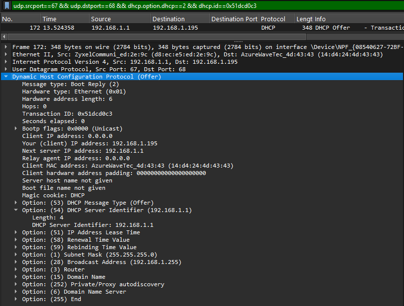
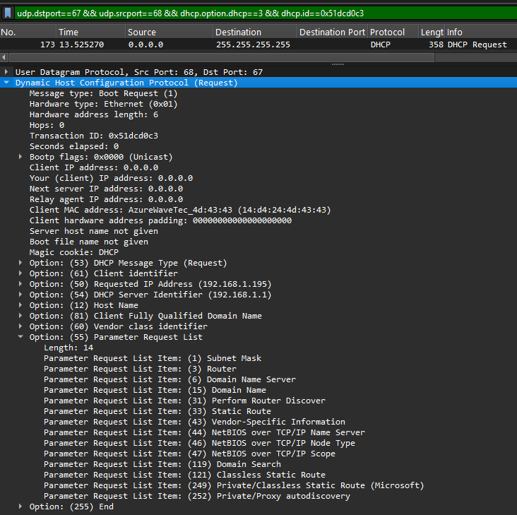
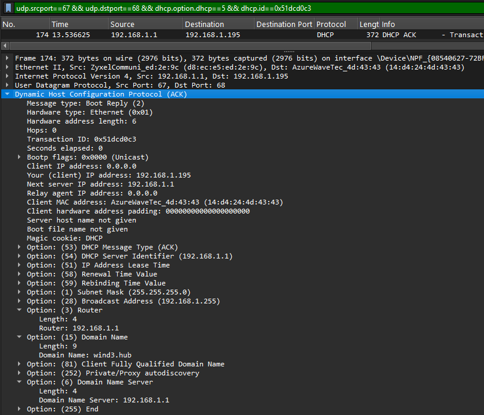
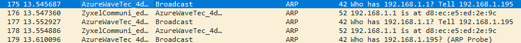
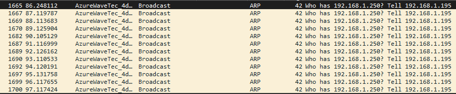

# Project 1--- Analisi del boot di rete ( DHCP + ARP su private LAN )

**Domanda guida:** come un client ottiene automaticamente il suo IP e il MAC del gateway, e perché ogni pacchetto viene inviato in quel modo?

## **Discovery**

Ho aperto il capture in Wireshark e ho seguito l’ordine reale degli eventi. Il primo segnale utile è il DHCP Discover, che è proprio l’inizio dell’autoconfigurazione IPv4 (DORA). Lo trovo con il filtro:

`eth.dst == ff:ff:ff:ff:ff:ff && udp.srcport == 68 && udp.dstport == 67 && dhcp.option.dhcp == 1`

Questo pacchetto è al frame 171. È in broadcast verso ff\:ff\:ff\:ff\:ff\:ff perché il client ancora non conosce nessun server; porta UDP 68→67 e contiene il Transaction ID (xid) 0x51dcd0c3, generato dal client per collegare tutti i messaggi della stessa negoziazione. Dentro c’è anche l’identità L2 del client, MAC 14\:d4:24:4d:43:43 (campo chaddr). In pratica il client “annuncia la sua presenza” e chiede una proposta.

## DHCP Offer

La risposta arriva subito come DHCP Offer. Per essere certo che è lo stesso dialogo, filtro con l’xid:

`udp.srcport==67 && udp.dstport==68 && dhcp.option.dhcp==2 && dhcp.id==0x51dcd0c3`

Lo trovo al frame 172. Qui il server mi dice “posso darti questo indirizzo”: nel campo yiaddr propone 192.168.1.195, e mi indica anche chi è il server tramite opzione 54 (Server Identifier) con 192.168.1.1. Questo Offer tipicamente viaggia unicast verso il MAC del client, perché ormai il server conosce l’hardware address del richiedente. Scientificamente l’Offer è solo una proposta (lease proposal), quindi ancora nulla è definitivo.
 

## DHCP Request

Subito dopo vedo il DHCP Request, che è il momento in cui il client dice “ok, prendo proprio quell’IP e scelgo quel server”. Il filtro è:

`udp.dstport==67 && udp.srcport==68 && dhcp.option.dhcp==3 && dhcp.id==0x51dcd0c3`

Il pacchetto è al frame 173. Dentro, l’opzione 50 conferma l’IP richiesto 192.168.1.195, in piena coerenza con l’Offer. Questo messaggio torna broadcast (i server multipli devono sapere chi è stato scelto). Interessante anche l’opzione 55 (Parameter Request List): qui la lunghezza è 14 byte, cioè il client domanda un set di 14 codici opzione (router, DNS, subnet mask, lease time, ecc.). Questo è fondamentale perché guida il contenuto dell’ACK: il server cercherà di soddisfare quella lista.
 

## DHCP ACK

Il ciclo DORA si chiude con il DHCP ACK, filtrato così:

`udp.srcport==67 && udp.dstport==68 && dhcp.option.dhcp==5 && dhcp.id==0x51dcd0c3`

È al frame 174. Qui il lease diventa effettivo: il server conferma l’allocazione e inserisce i parametri finali. Tra questi leggo il Lease Time (opzione 51) = 43200 secondi, cioè 12 ore; un valore molto comune su reti casalinghe. Questo numero guida il comportamento del client per i futuri rinnovi (T1/T2), quindi non è un dettaglio cosmetico: determina quando il client inizierà a rinegoziare per mantenere l’IP. A questo punto posso dire che il conteggio dei pacchetti DHCP per questo handshake, filtrando per `dhcp.id==0x51dcd0c3`, è 4 (Discover, Offer, Request, ACK). Tutto pulito, nessun NAK o retry sospetti.

 
## ARP per il Gateway

Subito dopo, come effetto pratico della configurazione, inizia la fase di neighbor discovery per parlare con l’esterno della subnet. Il client invia una ARP Request per il gateway 192.168.1.1; uso il filtro:

`arp && eth.dst==ff:ff:ff:ff:ff:ff && arp.opcode==1 && arp.dst.proto_ipv4==192.168.1.1`

La richiesta è al frame 175. Mittente L2 confermato: 14\:d4:24:4d:43:43. Destinazione IP dentro l’ARP: 192.168.1.1. Questa domanda “Who has 192.168.1.1?” è broadcast perché l’associazione IP→MAC non è ancora nota. È lo step naturale dopo il DHCP: senza il MAC del router, niente traffico off-subnet.

## Risposta ARP del Gateway

Dopo la richiesta ARP del frame 175, controllo la risposta del gateway perché senza quella l’host non può inoltrare pacchetti fuori dalla subnet. In Wireshark imposto il filtro mirato:

`arp && eth.dst==14:d4:24:4d:43:43 && arp.src.proto_ipv4==192.168.1.1 && arp.opcode==2`

La risposta ARP arriva in unicast al mio MAC e sta al frame 176. A livello scientifico è l’operazione “is-at”: il router dichiara “192.168.1.1 is-at d8\:ec\:e5\:ed:2e:9c”. Verifico i dettagli aprendo questo frame con un filtro diretto: `frame.number==176`. L’opcode è 2 (quindi reply) e il MAC mittente del gateway è d8\:ec\:e5\:ed:2e:9c. Questo valore è cruciale: l’host lo mette in ARP cache e da adesso in poi tutti i pacchetti destinati a IP fuori dalla LAN useranno d8\:ec\:e5\:ed:2e:9c come eth.dst. È la chiusura naturale del setup post-DHCP: prima ho l’IP via DORA, poi apprendo il next-hop L2 via ARP.

Per completezza controllo ancora la coerenza interna del pacchetto. Con `frame.number==176` vedo che l’opcode 2 distingue chiaramente la reply dalla request (che sarebbe opcode 1). Questo evita ambiguità quando c’è molto traffico ARP in broadcast. Inoltre, avere il MAC del gateway mi permette di diagnosticare futuri problemi: se più dispositivi rispondono per 192.168.1.1, potrei sospettare ARP spoofing o configurazioni strane. Qui invece tutto clean: una sola reply, un solo MAC, nessuna collisione.

 
 

## Test con ARP Probe

Passo poi a un test diverso ma utile in reti piccole...la ARP probe verso un IP non usato, in questo caso 192.168.1.250. L’idea è semplice: chiedo “who has 192.168.1.250?” e vedo se qualcuno risponde. In Wireshark filtro le requests con:

`arp && eth.dst==ff:ff:ff:ff:ff:ff && arp.opcode==1 && arp.dst.proto_ipv4==192.168.1.250`

Nel capture trovo più richieste ripetute ai frame 1665, 1667, 1669, 1670, …. Il pattern ripetuto è normale: molti host mandano più probe per essere sure che la rete non perda il primo broadcast. Dal punto di vista del protocollo, è una tecnica di collision avoidance a livello IP: prima di usare o prenotare un indirizzo, controllo che nessuno lo possieda già.

 

 
Ora voglio sapere se esistono risposte per quell’IP. Uso il filtro che pesca solo le ARP Reply con il sorgente IP corrispondente:

`arp && arp.opcode==2 && arp.src.proto_ipv4==192.168.1.250`

Il conteggio è zero: nessuna risposta. Questo è esattamente il comportamento atteso quando l’indirizzo è libero in LAN. In pratica, conteggio risposte = 0 significa che nessun host ha rivendicato 192.168.1.250; quindi se dovessi configurarlo manualmente non creerei un conflitto (ovviamente poi servono altre verifiche di rete, ma come primo check va bene).

## Conclusioni

 Il DHCP handshake completo, tracciato con `dhcp.id==0x51dcd0c3`, ha prodotto 4 pacchetti in ordine rigoroso: Discover (frame 171), Offer (frame 172) con yiaddr 192.168.1.195 e Server ID 192.168.1.1, Request (frame 173) con opzione 50 = 192.168.1.195 e PRL di 14 byte, e ACK (frame 174) con Lease Time 43200 s (12h). Subito dopo, la neighbor discovery ha risolto il MAC del gateway d8\:ec\:e5\:ed:2e:9c tramite la sequenza ARP request (frame 175) → ARP reply (frame 176, opcode 2). Infine, la sonda ARP su 192.168.1.250 ai frame 1665/1667/1669/1670… non ha ricevuto reply, confermando l’IP disponibile al momento dell’acquisizione.
