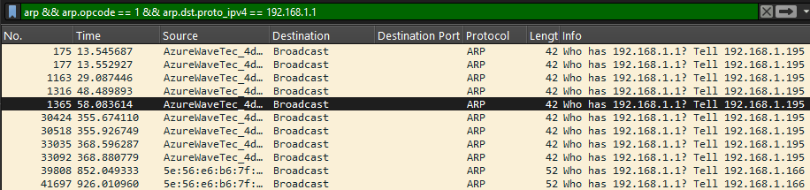
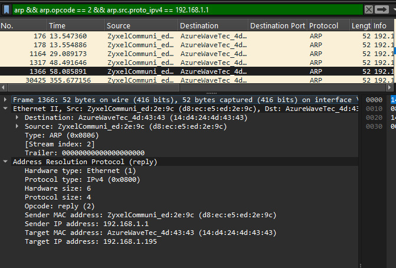
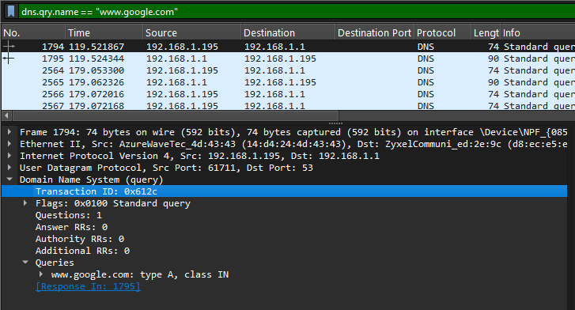

# Project 2-- Analisi della risoluzione DNS con ARP e Query/Response

**Domanda guida:** come un client ottiene il MAC del server DNS e risolve il nome [www.google.com](http://www.google.com), e perché ogni pacchetto viene inviato in quel modo?

## ARP verso il server DNS

L’analisi comincia cercando un’eventuale richiesta ARP per il server DNS 192.168.1.1. In Wireshark uso il filtro:

`arp && arp.opcode == 1 && arp.dst.proto_ipv4 == 192.168.1.1`

È difficile indicare con precisione quale sia la richiesta ARP inviata per trovare il server DNS di www.google.com, poiché il server DNS e il gateway condividono lo stesso indirizzo IP. Presumendo che il MAC del gateway sia già stato trovato in precedenza, mi concentro quindi sulla richiesta ARP più vicina nel tempo alla risoluzione del server di Google. In generale, la cache ARP riduce il traffico di rete evitando pacchetti inutili, ma può rendere complesso identificare l’esatto pacchetto in un’analisi come questa.

Il MAC mittente atteso per una richiesta da questo host sarebbe 14:d4:24:4d:43:43, cioè quello della mia scheda di rete (AzureWaveTec). Questo campo identifica il dispositivo che effettua la richiesta nella rete locale e deve corrispondere al mio hardware per confermare la provenienza.

L’IP di destinazione della richiesta sarebbe 192.168.1.1, ossia il server DNS. La richiesta ARP chiede “Chi ha 192.168.1.1?” per ottenere il MAC necessario alla comunicazione a livello IP.

## Risposta ARP dal server DNS

Trovo invece la risposta ARP dal server DNS usando il filtro:

`arp && arp.opcode == 2 && arp.src.proto_ipv4 == 192.168.1.1`

Vedendo al frame 1366. Conferma il legame tra l’IP del DNS e il suo MAC e arriva subito prima della risposta DNS. L’opcode 2 indica che si tratta di una reply. Verificare questo campo evita ambiguità e assicura che si tratti di una risposta corretta.

Il MAC destinatario in questa risposta è 14:d4:24:4d:43:43, cioè il mio computer, che partecipa allo scambio ARP e sarà riconosciuto dal server per le comunicazioni successive.

 
## DNS Query per [www.google.com](http://www.google.com)

Il passo successivo è la query DNS. Uso il filtro:

`dns.qry.name == "www.google.com"`

Trovo la richiesta al frame 1794. Questa è la query inviata dal mio PC al server DNS, con sorgente una porta effimera e destinazione la porta 53. Il Transaction ID è 0x612c, un numero che collega la richiesta alla risposta. Il nome richiesto è www.google.com, di tipo A e classe IN, che indica un record IPv4 per Internet.

Il campo Flags vale 0x0100 con RD=1, cioè recursion desired attivo. Questo significa che il client chiede al server di completare la risoluzione per lui.

 
## DNS Response corrispondente

La risposta DNS corrispondente si trova al frame 1795. Ho verificato che il Transaction ID coincida con quello della query. Il campo Answer Count vale 1, quindi il server fornisce un solo record come risposta. Il nome del primo answer è www.google.com, tipo A e classe IN (0x0001).

Il TTL è 64 secondi, indicando per quanto tempo la risposta può restare in cache. L’RDATA restituito è 216.58.209.36, l’indirizzo IPv4 associato al dominio richiesto.

In totale, per questa ricerca compaiono due pacchetti DNS: uno di query e uno di risposta. L’RCODE è  0, cioè nessun errore, a conferma che la risoluzione è avvenuta con successo.

## Conclusioni

La sequenza osservata indica che non è semplice individuare una richiesta ARP specifica per il DNS di www.google.com, poiché il server DNS condivide l’IP con il gateway e il MAC di quest’ultimo era già stato trovato in precedenza. Pertanto, l’analisi si è concentrata sulla richiesta ARP più vicina temporalmente alla risoluzione di Google. La risposta ARP al frame 1366 ha comunque confermato la mappatura IP→MAC necessaria Subito dopo, la query DNS al frame 1794 ha richiesto la risoluzione di www.google.com con Transaction ID 0x612c. La risposta al frame 1795 ha fornito l’indirizzo 216.58.209.36 con TTL di 64 secondi, completando la risoluzione in soli due pacchetti e senza errori. Questa sequenza conferma il corretto funzionamento del processo ARP+DNS nella rete analizzata
