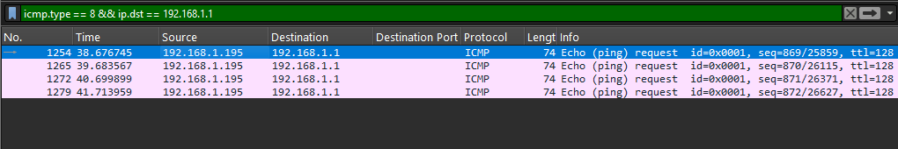
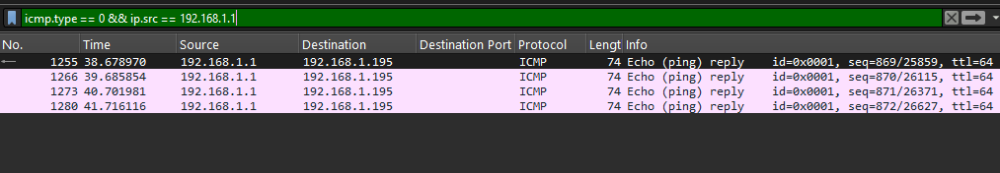
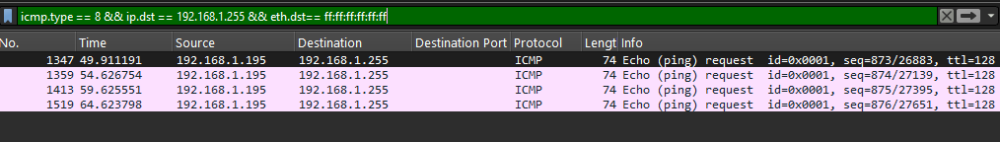
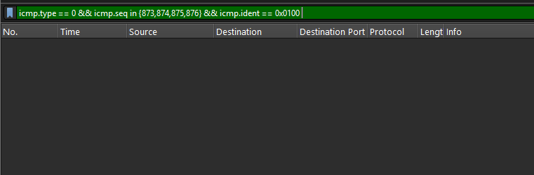
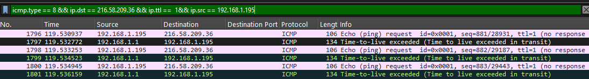
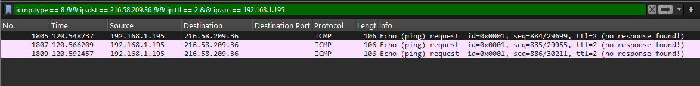

# Project 3--- ICMP: Analisi e Interpretazione dei Processi di Rete

**Domanda guida**
Come si sviluppano e si collegano tra loro le sequenze di pacchetti ARP e ICMP in un'analisi di rete, e cosa mi rivelano sul funzionamento e lo stato della connessione?

---
Per osservare il comportamento del protocollo ICMP ho lanciato diversi comandi ping, iniziando dal gateway del router, poi in broadcast a tutta la rete e infine verso un indirizzo IP libero. Durante queste prove ho potuto seguire il flusso delle comunicazioni ARP e ICMP, che parte dalla risoluzione del MAC address del gateway e continua con lo scambio di richieste e risposte di connettività. Ho incluso anche un test di ping verso un server remoto come www.google.com, così da confrontare il traffico locale con quello esterno alla rete.

[Traffic capture pcap](../pcaps/mixed_traffic.pcapng)

## **Risoluzione ARP del gateway (192.168.1.1)**

Comincio con la richiesta ARP per individuare il MAC address associato all'IP del gateway, 192.168.1.1. Il pacchetto di richiesta ha come mittente il mio MAC 14\:d4:24:4d:43:43 e come destinazione IP 192.168.1.1, individuato con il filtro:

`arp && arp.opcode== 1 && arp.dst.proto_ipv4 == 192.168.1.1`

Questa trasmissione è di tipo broadcast: il mio PC invia un messaggio a tutta la rete chiedendo chi possiede quell'indirizzo IP. La risposta, identificata dall'opcode 2 e dal MAC mittente d8\:ec\:e5\:ed:2e:9c, conferma l'identità del gateway, permettendomi di instradare il traffico oltre la rete locale.

## **Test di connettività ICMP verso il gateway**

Con il MAC del gateway noto, il passo successivo è il test di connettività tramite ICMP Echo Request verso 192.168.1.1. Con il filtro:

`icmp.type == 8 && ip.dst == 192.168.1.1`

osservo pacchetti con Identifier (BE): 1 (0x0001) e numeri di sequenza 869–872. Questo è un ping che, se riceve risposta, dimostra che il gateway è raggiungibile. La risposta, catturata con `icmp.type == 0`, mostra lo stesso identifier e un TTL di 64, tipico di un router in questa rete. Questa conferma per me è fondamentale per validare il collegamento di base.

## **Ping ICMP in broadcast sulla LAN (192.168.1.255)**

Proseguo con un test ICMP in broadcast verso 192.168.1.255, filtrato con:

`icmp.type == 8 && ip.dst == 192.168.1.255 && eth.dst== ff:ff:ff:ff:ff:ff`

Qui il MAC di destinazione è ff\:ff\:ff\:ff\:ff\:ff. Questo tipo di ping serve a individuare tutti i dispositivi attivi nella rete. Tuttavia, in questo caso, il conteggio delle Echo Reply ricevute è pari a zero. Nessuna risposta significa che i dispositivi in rete non accettano o non rispondono a ping broadcast, una scelta comune per motivi di sicurezza. Non avendo ricevuto risposte, non posso osservare alcun IP sorgente.

## **Traceroute verso [www.google.com](http://www.google.com)**

**Primo passo (TTL = 1)**
La fase successiva riguarda il traceroute verso [www.google.com](http://www.google.com). Il primo passo è un Echo Request con TTL=1 verso 216.58.209.36, filtrato con:

`icmp.type == 8 && ip.dst == 216.58.209.36 && ip.ttl == 1`

Questi pacchetti scadono immediatamente al primo hop (192.168.1.1), che mi risponde con messaggi ICMP Time Exceeded. Questo comportamento mi conferma che il gateway è il primo nodo del percorso e che è configurato per inviare notifiche ICMP quando i pacchetti vengono scartati per TTL scaduto.

**Secondo passo (TTL = 2)**
Il secondo passo utilizza Echo Request con TTL=2. In questo caso i pacchetti raggiungono il secondo router lungo il percorso, ma non ricevo alcun messaggio di risposta. Questo non significa che i pacchetti “non siano arrivati”, ma piuttosto che il router non ha inviato (o che un firewall ha bloccato) il messaggio ICMP Time Exceeded. Il risultato è un “vuoto” nella catena di hop, tipicamente rappresentato da \* nelle uscite di traceroute.

 

**Passo finale (TTL = 9)**
Il traceroute prosegue con un Echo Request con TTL sufficientemente alto (TTL=9) per raggiungere la destinazione. I pacchetti numerati 1946, 1948 e 1950, filtrati con `icmp.type== 8 && ip.dst == 216.58.209.36`, arrivano a Google. La risposta, filtrata con `icmp.type== 0 && ip.src == 216.58.209.36`, è un Echo Reply con type/code 0/0 e IP sorgente 216.58.209.36, che mi conferma la raggiungibilità della destinazione.

Alcuni dettagli tecnici completano la mia analisi. Nell'Echo Request unicast, il campo IPv4 Identification è 0x0000 (0), segno che non c’è frammentazione del pacchetto. Nell'Echo Request broadcast, la lunghezza dell'header IPv4 è di 20 byte, valore standard in assenza di opzioni aggiuntive. Infine, nei messaggi Time Exceeded, l'inner TTL è pari a 1, indicando che il pacchetto è stato scartato immediatamente dopo l'ultimo decremento del TTL.

## **Conclusioni**

Attraverso questa analisi ho ricostruito passo dopo passo il comportamento della mia rete locale e il percorso verso una destinazione esterna. La risoluzione ARP iniziale mi ha permesso di ottenere il MAC del gateway, primo requisito per qualsiasi comunicazione fuori dalla mia macchina. Con ICMP ho verificato la raggiungibilità del gateway e ho potuto constatare che i pacchetti broadcast non generano risposte, segno di una scelta deliberata di sicurezza dei dispositivi nella LAN.

Il traceroute ha mostrato chiaramente come i pacchetti con TTL limitato rivelino i nodi intermedi: il primo hop (il gateway) ha risposto regolarmente con ICMP Time Exceeded, mentre il secondo hop è rimasto silente, probabilmente a causa di filtri o configurazioni di sicurezza. Con un TTL più alto sono riuscito a raggiungere il server Google, ricevendo Echo Reply che confermano la connettività end-to-end
