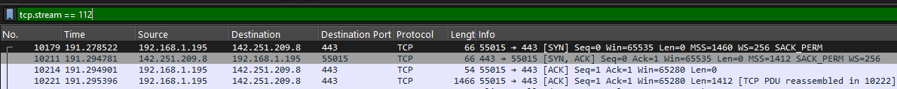
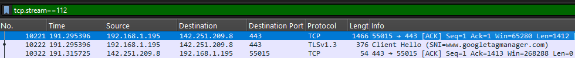
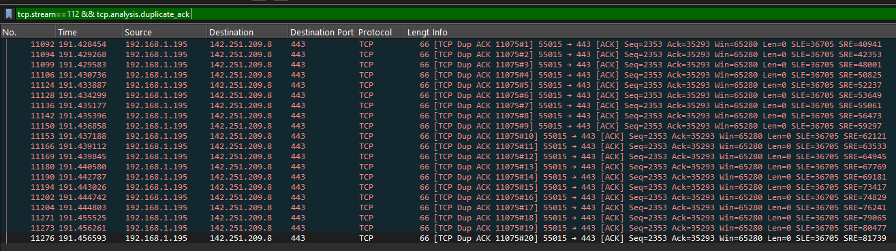
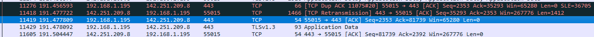
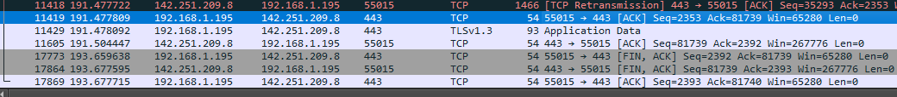

# Progetto: Analisi di una sessione TCP con ritrasmissione

**Domanda guida:** come un client costruisce la connessione TCP verso un server esterno, come vengono scambiati i primi dati e in che modo il protocollo gestisce le perdite di pacchetti?

## ARP Request per il Gateway

Appena apro il capture in Wireshark, noto che il primo passo fondamentale prima di qualsiasi traffico TCP è la risoluzione ARP. Il client deve conoscere l’indirizzo MAC del gateway 192.168.1.1, altrimenti non potrebbe inoltrare pacchetti fuori dalla sua subnet. Per filtrare la richiesta uso:

`arp && arp.opcode==1 && arp.dst.proto_ipv4==192.168.1.1 && eth.dst==ff:ff:ff:ff:ff:ff`

Questa query mi porta al frame in cui vedo chiaramente che il Sender MAC è 14\:d4:24:4d:43:43. L’ARP Request è in broadcast, perché il client non conosce ancora l’associazione IP→MAC del router. Il Target IP è 192.168.1.1. A livello scientifico questo passaggio è inevitabile: senza ARP, i pacchetti IP rimarrebbero “bloccati” nello strato di rete, incapaci di uscire verso Internet.

## ARP Reply del Gateway

Subito dopo la richiesta, osservo la risposta dal router. Per individuarla uso:

`arp && arp.opcode==2 && arp.src.proto_ipv4==192.168.1.1 && eth.dst==14:d4:24:4d:43:43`

Qui il pacchetto contiene opcode 2, cioè un “reply”. Il Sender MAC del gateway è d8\:ec\:e5\:ed:2e:9c. Questa risposta arriva unicast, direttamente all’indirizzo del client. Dal punto di vista scientifico il router dichiara: “192.168.1.1 is-at d8\:ec\:e5\:ed:2e:9c”. Questo dato viene memorizzato nella ARP cache e d’ora in poi il client saprà a chi consegnare tutti i pacchetti fuori subnet. Senza questa fase, il TCP handshake non potrebbe neanche iniziare.

## TCP Three-Way Handshake

Con il MAC del router ormai noto, la comunicazione TCP può partire. La prima parte è il SYN del client. Filtro con:

`tcp.stream==112 && ip.src==192.168.1.195 && ip.dst==142.251.209.8 && tcp.flags.syn==1 && tcp.flags.ack==0`

Il pacchetto mostra porta sorgente 55015 e porta destinazione 443. La porta 443 indica che il servizio richiesto è HTTPS, mentre la sorgente è effimera e viene scelta dal sistema operativo. Questo è l’avvio ufficiale della sessione TCP, dove il client propone il suo Initial Sequence Number.

La risposta dal server è un SYN-ACK, trovato con:

`tcp.stream==112 && ip.src==142.251.209.8 && ip.dst==192.168.1.195 && tcp.flags.syn==1 && tcp.flags.ack==1`

Qui il Sequence Number è 899064933 e l’ACK è 4013594088, che corrisponde al numero del client + 1. In questo modo il server conferma la ricezione del SYN e manda a sua volta il suo ISN. Il fatto che entrambi i flag SYN e ACK siano attivi è la caratteristica distintiva di questa fase.

Infine, il client risponde con l’ACK conclusivo:

`tcp.stream==112 && ip.src==192.168.1.195 && ip.dst==142.251.209.8 && tcp.len==0 && tcp.flags.ack==1 && tcp.flags.syn==0`

Il pacchetto mostra numero di ACK = 899064934 e TTL = 128. Non porta dati, ma chiude formalmente la three-way handshake. Dopo questo punto la connessione è pronta al trasferimento.
 

## Trasferimento iniziale dei dati

Il primo segmento dati appare subito dopo. Uso il filtro:

`tcp.stream==112 && ip.src==192.168.1.195 && ip.dst==142.251.209.8 && tcp.len>0`

Ho individuato un pacchetto con Sequence Number 4013594088 (relative 1) che contiene un payload di 1412 byte.
Si tratta del primo segmento TCP con dati applicativi (record TLS cifrati) della sessione.
La dimensione del payload riflette il limite imposto dall’MSS (Maximum Segment Size), che stabilisce la quantità massima di dati trasportabili in un singolo segmento TCP senza frammentazione IP
Il server risponde con un ACK: 

`tcp.stream==112 && ip.src==142.251.209.8 && ip.dst==192.168.1.195 && tcp.ack_raw==4013595500`

L’ACK è 4013595500 (4013594088+1412) e i flag mostrano ACK puro (0x010). È la conferma di corretta ricezione e abilita il client a continuare.

 

## Retransmition della perdita

Analizzando la cattura, noto un evento interessante... un segmento non è stato ricevuto dal server. Per individuarlo...

`tcp.stream==112 && tcp.analysis.retransmission`

Qui appare una ritrasmissione con Sequence Number(relative) 35293. L’originale però non compare nella cattura, segno che si è perso o sulla rete o nel punto di sniffing. questo significa che il flusso di byte previsto dal client ha avuto una “lacuna” e il server non ha potuto avanzare il suo ACK. È proprio questa condizione che innesca il meccanismo di controllo errore TCP.

Per confermare la perdita, osservo i duplicati di ACK. Con...

`tcp.stream==112 && tcp.analysis.duplicate_ack`

Il primo ACK duplicato appare al frame 11092 e porta ancora Ack = 35293. Un secondo duplicato compare al frame 11094, sempre con lo stesso valore. Questo comportamento è classico: quando il ricevente vede pacchetti fuori ordine, continua a chiedere lo stesso byte di partenza, segnalando chiaramente la mancanza. TCP di solito attende tre duplicati prima di attivare il fast retransmit, ma ci sono ben 20 duplicati.
 

## Retransmition e recupero

Dopo gli ACK duplicati, controllo il pacchetto di ritrasmissione vero e proprio. Uso di nuovo:

`tcp.stream==112 && tcp.analysis.retransmission`

Qui, al frame 11418, trovo una copia del segmento mancante con lo stesso numero di sequenza 35293. è stata innescata dopo circa 20 ACK duplicati, segno di una perdita persistente. TCP reagisce così per recuperare il segmento mancante e ristabilire il flusso dei dati.
Subito dopo appare un ACK che conferma la ricezione:

`tcp.stream==112 && tcp.flags.ack==1 && tcp.seq==0 && tcp.ack_raw==81739`

L’ACK è 81739 e i flag sono solo ACK (0x010). Questo significa che il server ha finalmente ricevuto il segmento e può far avanzare il suo puntatore di flusso. Con questa conferma la sessione torna in stato stabile e il problema di perdita è risolto. 
Non noto aggiornamenti della finestra TCP: i valori restano 65280 per il client e circa 267776 per il server, segno che i buffer erano già sufficienti e non serviva pubblicizzare nuovo spazio.

 

## Ripresa del flusso dati

Dopo la ritrasmissione, controllo i segmenti successivi con:

`tcp.stream==112 && tcp.len>0 && frame.number>11418`

Trovo segmenti che proseguono con numeri di sequenza normali, in continuità col flusso precedente. Anche qui i payload mostrano dimensioni regolari e non emergono anomalie. Gli ACK corrispondenti, filtrati con:

`tcp.stream==112 && tcp.flags.ack==1 && frame.number>11418`

confermano puntualmente i byte ricevuti. È chiaro che la sessione ha “assorbito” l’incidente e ha ripreso la velocità normale. Questo è uno dei punti di forza del TCP: la resilienza agli errori di rete senza perdere lo stato della connessione.

## Chiusura della connessione TCP

Alla fine della sessione, il client invia un pacchetto FIN per chiudere la comunicazione. Lo individuo con:

`tcp.stream==112 && tcp.flags.fin==1 && ip.src==192.168.1.195`

Il pacchetto ha Sequence Number 2392 e lunghezza totale 54 byte(solo headrs). Non trasporta dati len=0, è solo un segnale di controllo. Questo è il primo passo della four-way handshake di chiusura.

Il server risponde con un pacchetto FIN+ACK:

`tcp.stream==112 && tcp.flags.fin==1 && tcp.flags.ack==1 && ip.src==142.251.209.8`

Qui vedo Sequence Number 81739 e Ack = 2393. In un solo pacchetto il server unisce la conferma della chiusura del client e la propria richiesta di chiudere. È un’ottimizzazione che riduce i passaggi.

Infine, il client manda l’ultimo ACK:

`tcp.stream==112 && tcp.flags.ack==1 && tcp.len==0 && ip.src==192.168.1.195`

Il valore di ACK è 81740 e la lunghezza del frame è 54 byte. Questo chiude ufficialmente la connessione: da questo momento la sessione TCP non esiste più nello stack.
 

## Conclusioni

L’analisi del capture mostra con chiarezza tutte le fasi fondamentali di una connessione TCP...dalla risoluzione ARP che permette al client di raggiungere il gateway, al three-way handshake che stabilisce i parametri iniziali, fino al trasferimento dei primi segmenti dati cifrati via TLS.
Il punto più interessante è il comportamento di TCP in presenza di perdita... la sequenza di venti ACK duplicati, seguita dalla ritrasmissione del segmento mancante, è la prova diretta della robustezza del protocollo. TCP non si limita a garantire l’affidabilità, ma adotta strategie come i duplicate ACK e la ritrasmissione anticipata per mantenere fluido il flusso dei dati anche in condizioni di rete imperfette.
Infine, la chiusura ordinata tramite la four-way handshake conferma la simmetria del protocollo. così come la connessione viene costruita con precisione, allo stesso modo viene smantellata senza lasciare stati “appesi” nei due endpoint.

