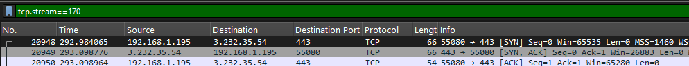
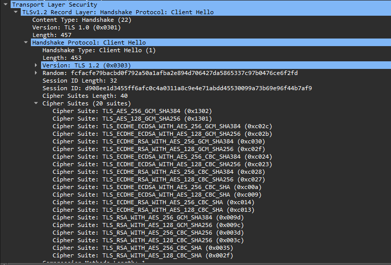
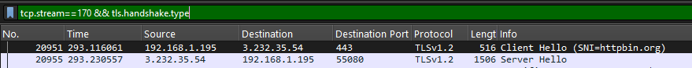
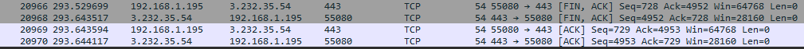

# Project 5--- Analisi di una connessione HTTPS 

**Domanda guida:** come si costruisce passo per passo una connessione sicura HTTPS, partendo dalla scoperta del gateway locale fino alla negoziazione TLS?

---
Per generare traffico HTTPS ho svolto diverse attività di navigazione e download. Ho aperto Google, ho scaricato un PDF dal sito httpbin, ho inviato una richiesta `curl` a un endpoint che restituisce dati compressi e ho guardato circa 30 secondi di video su YouTube. Tutte queste azioni hanno prodotto sessioni cifrate osservabili nei pacchetti catturati.

## ARP verso il Gateway

Il primo movimento che vedo nel capture è la ricerca del router. Il mio computer deve sapere a quale MAC mandare i pacchetti IP fuori dalla subnet, quindi manda una richiesta ARP in broadcast. Per isolarla uso il filtro:

`arp && arp.opcode == 1 && arp.dst.proto_ipv4 == 192.168.1.1`

Il pacchetto mostra il mio MAC come mittente (14\:d4:24:4d:43:43) e come IP destinatario 192.168.1.1. In pratica il messaggio è “Chi ha 192.168.1.1?”. Questo step è basilare: senza conoscere il MAC del router non potrei mai spedire il SYN TCP verso il server HTTPS.

Subito dopo trovo la risposta del router, filtrata con:

`arp && arp.opcode == 2 && arp.src.proto_ipv4 == 192.168.1.1`

Qui l’Operation code è 2, cioè reply, e il MAC mittente è d8\:ec\:e5\:ed:2e:9c. A livello scientifico è il momento in cui il router dice: “192.168.1.1 is-at d8\:ec\:e5\:ed:2e:9c”. Questa informazione entra nella ARP cache del mio computer e diventa il punto di riferimento per ogni pacchetto IP destinato a Internet.

## Handshake TCP verso il server HTTPS

Con il MAC del gateway noto, il mio computer può spedire il SYN TCP. Uso:

`tcp && tcp.flags.syn == 1 && tcp.flags.ack == 0 && tcp.dstport == 443`

Lo trovo con numero di stream 170(tcp stream verso httpbin.org), porta sorgente 55080 e porta destinazione 443. La 443 indica HTTPS, mentre 55080 è una porta effimera scelta automaticamente dal sistema. Questo SYN è il primo passo della three-way handshake, dove io propongo un numero di sequenza iniziale al server.

Il server risponde con un SYN-ACK, che individuo con:

`tcp.stream==170 && tcp.flags.syn == 1 && tcp.flags.ack == 1 && tcp.srcport == 443`

Qui i valori sono: Sequence number = 3307278008 e Acknowledgement number = 1838074487. In questo modo il server mi dice “ho ricevuto il tuo SYN e ti mando anche il mio ISN”. È la conferma che la comunicazione è viva dall’altra parte.

Il mio computer chiude l’handshake con l’ACK finale:

` tcp.stream==170  && tcp.flags == 0x10 && tcp.dstport == 443`

Questo pacchetto ha Acknowledgement number = 3307278009 e TTL = 128. Non trasporta dati, ma è fondamentale perché completa la three-way handshake. Solo dopo questo punto i dati applicativi possono iniziare a fluire.
 

## Inizio della negoziazione TLS

Ora il browser deve stabilire il livello sicuro sopra TCP, cioè TLS. Il primo messaggio è il ClientHello, che trovo con:

`tcp.stream==170 && tls.handshake.type==1`

Il pacchetto mostra versione TLS = 0x0303 e Session ID length = 32. Qui il client dice al server “ecco le versioni TLS e i cipher che so usare”. 0x0303 corrisponde a TLS 1.2, una versione molto diffusa. La Session ID di 32 byte serve per la ripresa di sessione... se in futuro faccio un’altra connessione con lo stesso server, posso saltare parte della negoziazione.
 

Il server risponde con il suo ServerHello:

`tcp.stream==170 && tls.handshake.type==2`

I dettagli sono: versione TLS = 0x0303 e Cipher Suite = TLS\_ECDHE\_RSA\_WITH\_AES\_128\_GCM\_SHA256 (0xc02f). Questo è il momento in cui il server decide: useremo TLS 1.2 e questa cifra AES a 128 bit in modalità GCM con SHA256. Con questa scelta, entrambi i lati hanno un set comune e possono passare alla fase successiva.
 

## Cambio di stato: ChangeCipherSpec del Client

Dopo il ServerHello, il client deve dichiarare che passerà alla cifratura per tutti i pacchetti successivi. In Wireshark lo individuo con:

`tcp.stream==170 && tls.record.content_type==20 && tcp.dstport==443`

Il pacchetto numero 20959, lunghezza record = 1. È brevissimo perché non contiene dati, ma solo il segnale di cambio. Questo messaggio è cruciale: indica che da questo istante tutti i contenuti applicativi (HTTP/2, richieste GET, risposte del server) saranno cifrati e quindi non leggibili in chiaro su Wireshark. è lo switch dal mondo “handshake visibile” al mondo “payload protetto”.

## Cambio di stato: ChangeCipherSpec del Server

Il server risponde con il proprio ChangeCipherSpec, trovato con:

`tcp.stream==170 && tls.record.content_type==20 && tcp.srcport==443`

È al pacchetto 20960 e la lunghezza è 1. Questo chiude la fase di setup TLS: entrambi i lati confermano che da adesso parleranno solo in cifrato. L’importanza di questo momento è enorme: senza questa doppia conferma non avrei garanzia che i dati viaggiano in sicurezza. Ora, finalmente, inizia la vera sessione HTTPS.

## Flusso HTTP/2 sopra TLS

Da questo punto in avanti non posso più osservare i dettagli applicativi, perché tutto il traffico è cifrato dentro TLS. Non vedo le richieste HTTP né le risposte del server, ma so che sopra HTTPS il browser può effettuare operazioni diverse... scaricare pagine HTML, immagini o PDF, inviare dati con POST, oppure ricevere risposte compresse in gzip. Tutti questi contenuti viaggiano nello stesso flusso sicuro, invisibili a chi cattura il traffico. L’unica cosa che resta analizzabile è la sequenza e la dimensione dei pacchetti, non il contenuto. Questo è il punto di forza di HTTPS. proteggere l’applicazione mantenendo efficiente la comunicazione

## Chiusura della connessione

Quando l’operazione è terminata, il flusso HTTP/2 viene chiuso ordinatamente. Subito dopo anche la connessione TCP si conclude con la sequenza di pacchetti di chiusura: il client invia un FIN, il server risponde con un pacchetto combinato FIN+ACK, e il client manda il suo Last ACK. In teoria qui la chiusura sarebbe completa, ma nel capture compare anche un ulteriore ACK dal server... si tratta di un pacchetto ridondante, probabilmente generato come ritrasmissione o conferma tardiva, che non cambia la logica del teardown. In ogni caso, la connessione risulta chiusa correttamente e tutte le risorse sono state liberate senza lasciare stati pendenti
 

## Conclusioni

L’analisi con Wireshark ha permesso di seguire passo per passo l’intero ciclo di vita di una connessione HTTPS...dalla scoperta del gateway con ARP, alla costruzione affidabile del canale TCP, fino alla negoziazione crittografica TLS e alla successiva trasmissione dei dati HTTP/2. Anche se il contenuto applicativo rimane cifrato e invisibile, i pacchetti osservati mostrano chiaramente come ogni livello del modello di rete contribuisca alla sicurezza e all’efficienza del flusso.
La risoluzione ARP mette in comunicazione la macchina con il router, l’handshake TCP assicura affidabilità punto a punto, TLS aggiunge la confidenzialità e l’integrità dei dati, mentre HTTP/2 sfrutta la multiplexing per migliorare le prestazioni. E il teardown finale con FIN e ACK.

