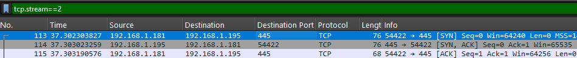
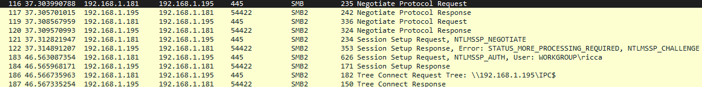
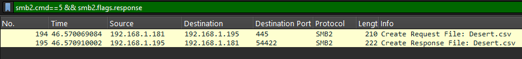
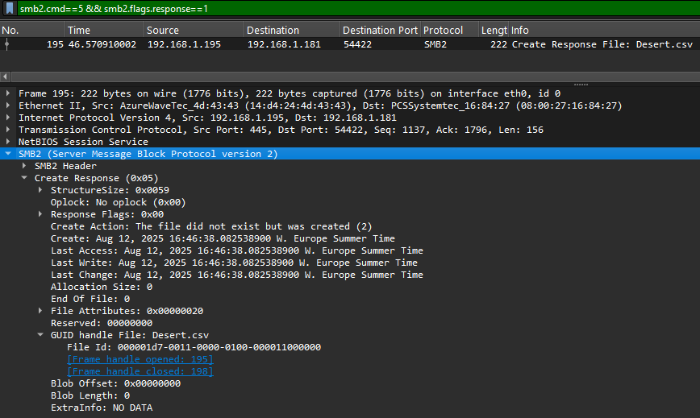
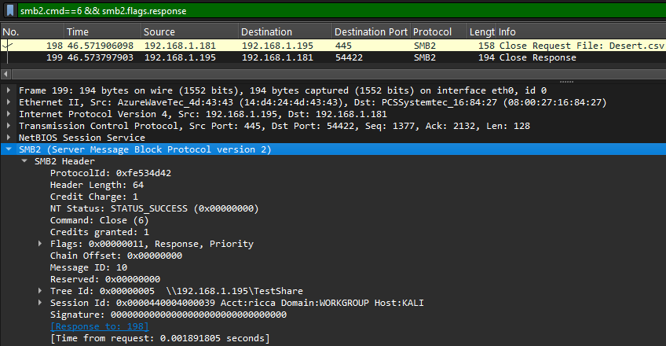
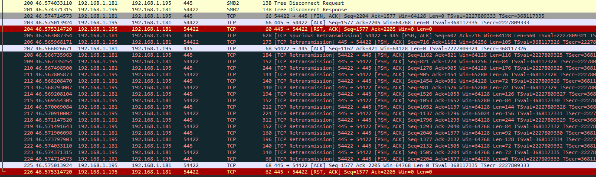

# Project 6-- Analisi di una connessione SMB 

**Domanda guida:** come avviene la comunicazione tra un client e un server SMB, dal primo pacchetto ARP fino alla connessione a una share di rete?

---

In questa parte ho generato traffico SMB2 inviando pacchetti dalla mia macchina virtuale Linux verso il server SMB presente nella stessa LAN. Ho stabilito una connessione a una cartella condivisa e ho effettuato la scrittura di un file di prova al suo interno, così da produrre traffico applicativo reale. In questo modo è stato possibile osservare in dettaglio lo scambio dei pacchetti SMB sulla porta 445

[SMB capture pcap](pcaps/smb445.pcap)

## ARP verso il server SMB

Prima di tutto, il client deve prima scoprire il MAC del server SMB, che ha IP 192.168.1.195. Per trovarlo uso il filtro:

`arp && arp.opcode==1 && arp.dst.proto_ipv4==192.168.1.195 && eth.dst==ff:ff:ff:ff:ff:ff`

Il pacchetto mostra Sender MAC = 08:00:27:16:84:27 e Target IP = 192.168.1.195. Questo è un broadcast: il client chiede “Chi ha 192.168.1.195?”. È indispensabile perché senza conoscere il MAC, non può iniziare il dialogo con il server a livello 2.

Subito dopo arriva la risposta, filtrata con:

`arp && arp.opcode==2 && arp.src.proto_ipv4==192.168.1.195 && eth.dst==08:00:27:16:84:27`

Questa volta Opcode = 2 (reply) e Sender MAC = 14\:d4:24:4d:43:43. Il server SMB risponde “192.168.1.195 is-at 14\:d4:24:4d:43:43”. Il client salva questa informazione nella sua ARP cache e adesso può costruire i pacchetti IP/TCP destinati al server.

## Handshake TCP su porta 445

Per aprire la connessione SMB, il client usa la porta TCP 445. Il primo passo è il SYN:

`tcp.flags.syn==1 && tcp.flags.ack==0 && tcp.dstport==445`

Trovo un pacchetto dentrp tcp stream 2 con Source Port = 54422 e Destination Port = 445. È il segnale iniziale con cui il client chiede al server di avviare la sessione TCP.

Il server risponde con un SYN-ACK:

`tcp.flags.syn==1 && tcp.flags.ack==1 && tcp.srcport==445`

Qui i valori sono Sequence Number = 1325589084 e Acknowledgement Number = 910341095. Significa che il server ha ricevuto il SYN e invia il suo numero iniziale di sequenza.

Infine, il client chiude la three-way handshake con un ACK:

`tcp.len==0 && tcp.flags.ack==1 && tcp.flags.syn==0 && tcp.src==192.168.1.181 && tcp.dstport==445`

Questo pacchetto ha Ack = 1325589085 e TTL = 64. Non contiene dati applicativi, ma ora il canale TCP è ufficialmente pronto per portare i messaggi SMB.
 

## Negoziazione del protocollo SMB

Il primo messaggio SMB dopo la handshake è un Negotiate Protocol Request. Lo trovo con:

`smb || smb2`

È al frame 116. In questo pacchetto il client elenca tutte le versioni SMB che supporta, in modo che il server scelga quella compatibile. È un passo cruciale perché garantisce che entrambi parlino la stessa “lingua” a livello applicativo.

La risposta del server è il Negotiate Protocol Response:

`smb || smb2`

Compare al frame 117. Qui il server dichiara che userà SMB2 invece di SMB1. Questo segna l’inizio ufficiale della sessione SMB: da ora in poi tutti i messaggi seguiranno il dialetto SMB2. È un passo fondamentale, perché solo dopo la negoziazione si può procedere con autenticazione e richieste di risorse.

## Connessione a una share di rete

Il passo successivo è la connessione a una share specifica. Per individuarlo uso:

`smb2 && smb2.cmd==3 && smb2.flags.response==0`

Trovo il Tree Connect Request che chiede di collegarsi alla share \\192.168.1.195\TestShare. A differenza di IPC$, questa è una normale share di rete usata per contenere file. Il server risponde con un Tree Connect Response e assegna un Tree ID (TID) = 0x00000001, che sarà usato in ogni comando successivo per riferirsi a quella risorsa. È come ricevere un “pass” per entrare nella cartella condivisa.

Il server risponde con:

`smb2 && smb2.cmd==3 && smb2.flags.response==1`

e assegna un Tree ID (TID) = 0x00000001. Questo identificatore sarà necessario in ogni comando successivo per riferirsi a quella share. È come ricevere un “pass” per entrare nella risorsa.
 

## Apertura del file sul server
Dopo aver collegato la share TestShare, il client apre un file con un SMB2 Create Request. Nel pacchetto vedo che il file richiesto è Desert.csv. Questo comando serve a dire al server: “voglio aprire o creare questo file, così posso leggerlo o scriverlo”. Il server risponde con un Create Response e assegna un File ID univoco, che verrà usato per tutte le operazioni successive (scrittura, chiusura)
 

Il primo passo è l’apertura di un file con un SMB Create Request. Lo filtro con:

`smb2.cmd==5 && smb2.flags.response==0`

Nel pacchetto vedo che il file richiesto è Desert.csv. Questo comando serve per dire al server: “voglio aprire o creare questo file, così posso leggerlo o scriverlo”.
Il server risponde al...

`smb2.cmd==5 && smb2.flags.response==1`

E assegna un File ID = 000001d7-0011-0000-0100-000011000000. Questo identificatore è univoco e verrà usato per tutte le operazioni successive (scrittura, chiusura). In pratica è come un “biglietto numerato” che rappresenta il file aperto. Senza di esso, il client non potrebbe inviare comandi al file.
 

## Scrittura dei dati nel file
Il passo più importante arriva ora... la scrittura. In Wireshark lo individuato con...

`smb2.cmd==9 && smb2.flags.response==0`

È un Write Request con Data length = 128 byte. Questo significa che il client sta inviando 128 byte del contenuto del file al server. In trasferimenti grandi, ci sarebbero più pacchetti Write, ma qui basta uno solo perché il file è piccolo.
La risposta del server arriva subito dopo:

`smb2.cmd==9 && smb2.flags.response==1`

E conferma Bytes written = 128. Questa conferma è fondamentale... se i byte scritti non coincidessero con quelli inviati, ci sarebbe un problema di integrità. Qui invece tutto è regolare. Posso anche contare le Write Request con..

`smb2.cmd==9 && smb2.flags.response==0`

Trovo solo 1 Write, segno che il file è stato scritto in un unico blocco.

## Chiusura del file
Dopo la scrittura, il client invia un Close Request per liberare le risorse. 

`smb2.cmd==6 && smb2.flags.response==0`

Il pacchetto contiene lo stesso File ID 000001d7-0011-0000-0100-000011000000, segno che il client chiede esplicitamente di chiudere quel file.
Il server risponde con:

`smb2.cmd==6 && smb2.flags.response==1`

E restituisce NT Status = STATUS_SUCCESS (0x00000000). Questo vuol dire che la chiusura è andata a buon fine e tutte le risorse legate al file sono state rilasciate. È un passo necessario per non lasciare handle aperti inutilmente sul server.
 

## Logoff della sessione SMB
In alcuni scenari, dopo la chiusura del file il client invia un pacchetto Logoff Request per chiudere formalmente la sessione SMB. Ma in questa cattura, quando filtro con...

`smb2.cmd==2 && smb2.flags.response==0`

non trovo nessun pacchetto. Questo significa che il client ha scelto di terminare la sessione chiudendo direttamente la connessione TCP, senza un logoff esplicito. Di conseguenza, non esiste neppure una risposta di logoff dal server. È un comportamento comune nei client che vogliono chiudere rapidamente.

## Chiusura della connessione TCP
Alla fine della sessione SMB il client invia un Tree Disconnect e riceve la conferma dal server, chiudendo correttamente la parte applicativa. Subito dopo avvia la terminazione della connessione TCP con un pacchetto FIN, ACK, a cui il server risponde con un ACK che conferma la ricezione. In teoria da qui il teardown dovrebbe proseguire con il FIN del server, ma nella cattura si nota un’anomalia.
 

il server continua a trasmettere dati verso il client, che però ha già segnalato di non voler più ricevere. Questi pacchetti vengono ritrasmessi più volte senza successo, fino a che la situazione viene risolta con l’invio di un RST, ACK, che forza la chiusura della connessione

## Conclusioni
Questa cattura mette in evidenza l’intero ciclo di vita di una connessione SMB, dalla scoperta ARP fino al teardown TCP. Dopo l’handshake iniziale, il client e il server negoziano SMB2 e stabiliscono un contesto comune per lavorare sulle share. L’apertura e la scrittura del file Desert.csv mostrano come SMB utilizzi identificatori univoci (File ID) per gestire le risorse e garantire l’integrità dei dati..i 128 byte inviati dal client vengono confermati e salvati dal server senza errori. La fase di chiusura evidenzia anche i limiti pratici... invece di un logoff formale, il client interrompe la sessione digitando il comando exit, che provoca la chiusura immediata della connessione TCP. Poiché il server stava ancora inviando dati pendenti, la sessione non si è chiusa con il classico teardown a quattro vie, ma è terminata con un reset (RST) che ha forzato la liberazione delle risorse.
