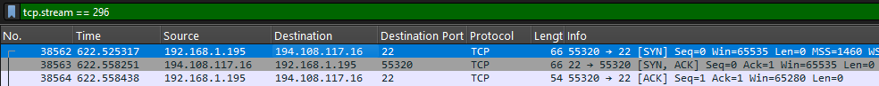
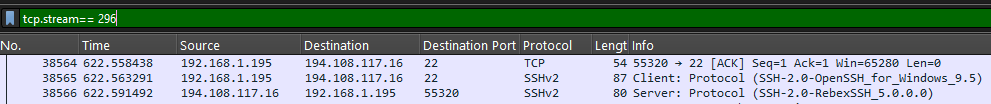
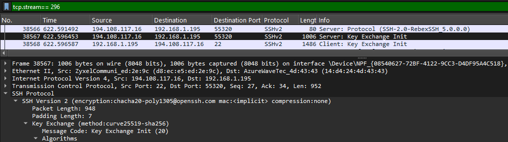
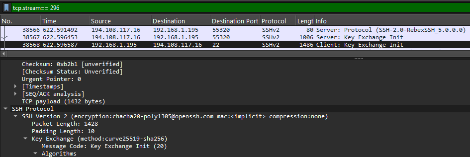
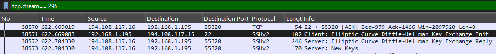
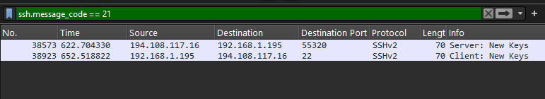

# Project 6--  Analisi di una Connessione SSH 

**Domanda guida:** come avviene l’apertura, la negoziazione e l’avvio cifrato di una connessione SSH, e quali pacchetti chiave si possono osservare in Wireshark?
---
Per questa analisi ho aperto una connessione remota con il comando `ssh` demo@test.rebex.net. Durante la sessione ho catturato il processo di handshake e i pacchetti successivi di mantenimento attivo.

[Traffic capture pcap](../pcaps/mixed_traffic.pcapng)

## Risoluzione ARP
La sequenza comincia come sempre con ARP. Il client vuole collegarsi al server SSH, ma prima deve sapere qual è il MAC associato all’IP del gateway. Per questo invia una richiesta ARP in broadcast:

`arp && eth.dst==ff:ff:ff:ff:ff:ff && arp.opcode==1 && arp.dst.proto_ipv4==192.168.1.1`

Questa richiesta parte dal client con MAC `14:d4:24:4d:43:43`. Subito dopo arriva la risposta ARP dal gateway (opcode 2), che dichiara: “192.168.1.1 is-at d8\:ec\:e5\:ed:2e:9c”. Questo passaggio è essenziale: senza il MAC corretto, nessun pacchetto TCP potrebbe uscire dal client. 

## Three-Way Handshake TCP

Dopo ARP, il client apre la connessione TCP verso la porta 22, che è il servizio SSH standard. Il primo pacchetto è un SYN con porta sorgente effimera 55320 e porta destinazione 22:

`tcp.stream== 296 && tcp.flags.syn==1 && tcp.flags.ack==0 && tcp.dstport==22`

Il server risponde con SYN-ACK, dove il numero di sequenza iniziale è diverso e il campo ACK vale 1. Infine il client invia l’ACK finale con TTL 128, completando il three-way handshake. Ora il canale TCP è stabile e pronto per il traffico SSH.

 

## Scambio Versione SSH (Banner Exchange)

La prima informazione leggibile non è cifrata... entrambi i sistemi dichiarano la loro versione SSH. Questo avviene con stringhe ASCII. Al frame 38565 il client manda il banner:

`SSH-2.0-OpenSSH_for_Windows_9.5`

Subito dopo, al frame 38566, il server risponde con:

`SSH-2.0-RebexSSH_5.0.0.0`

Questa fase serve a garantire compatibilità. Senza banner coerenti, la connessione verrebbe chiusa subito. 
 

## Negoziazione Algoritmi (KEXINIT)

Ora comincia la parte più importante: la scelta degli algoritmi di crittografia. Sia il client (frame 38568) che il server (frame 38567) inviano un messaggio KEXINIT, ciascuno con una lista di algoritmi supportati per key exchange, cifratura, MAC e compressione. Successivamente viene scelto, per ogni categoria, il primo algoritmo compatibile tra le due liste; in questo caso l’algoritmo di scambio chiavi selezionato è curve25519-sha256, molto diffuso nelle implementazioni moderne per la sua sicurezza ed efficienza.
Il principio è che entrambi devono condividere almeno un algoritmo per ogni categoria. Se non trovano compatibilità, la sessione fallisce. Questa fase si vede con:

`ssh && frame.number==38567`
 

e

`ssh && frame.number==38568`
 

Ed è la base su cui viene costruita la cifratura futura.

## Diffie-Hellman Key Exchange

Dopo l’accordo sugli algoritmi, il client e il server iniziano il vero scambio di chiavi. In questo caso viene usato curve25519-sha256. Il client invia il suo valore pubblico (frame 38571), il server risponde con il proprio valore (frame 38572).

L’idea matematica dietro è che, anche se un attaccante cattura i pacchetti, non può ricostruire la chiave segreta finale. Questo perché Diffie-Hellman (e in particolare Curve25519) permette di generare una shared secret solo conoscendo le due chiavi private, che restano sempre nascoste.

Dopo questo punto, sia client che server possono calcolare la stessa chiave segreta simmetrica, che verrà usata per cifrare il resto del traffico.

 

## Scambio NEWKEYS

Una volta calcolata la chiave condivisa, entrambi i lati inviano un pacchetto chiamato NEWKEYS. Questo segnala... “da adesso in poi parliamo cifrato”.

Il server lo invia al frame 38573, e il cliente risponde al frame 38923.
(In teoria entrambi i lati inviano NEWKEYS quasi subito, ma in questa cattura si osserva un intervallo tra il messaggio del server e quello del client.)
 Dopo questi due pacchetti, il contenuto diventa incomprensibile in Wireshark perché tutti i campi applicativi vengono cifrati.

Il filtro utile qui è:

` tcp.stream==296 && ssh.message_code == 21`

(21 è proprio il codice per NEWKEYS).

 

In una sessione SSH, dopo lo scambio delle chiavi e l’autenticazione dell’utente, viene aperto un canale sicuro tra client e server... da questo momento in poi tutto il traffico (comandi inviati, output ricevuto, gestione del terminale) è completamente cifrato e Wireshark non mostra il contenuto in chiaro, ma solo pacchetti contrassegnati come “Encrypted packet”. Dietro le quinte, quello che avviene è che l’utente dimostra la propria identità, il server conferma, e viene stabilito un canale sul quale possono fluire in modo protetto dati e comandi.

Infine, la sessione si chiude con il messaggio SSH_MSG_CHANNEL_CLOSE e successivamente con un pacchetto TCP RST, ACK, che indica una chiusura improvvisa della connessione invece della terminazione ordinata tramite FIN/ACK

## Conclusioni

Dalla cattura emerge chiaramente la sequenza che porta alla creazione di una sessione SSH sicura. Dopo i passaggi preliminari (ARP e three-way handshake TCP), client e server si scambiano il banner di versione e negoziano gli algoritmi da utilizzare. Con lo scambio Diffie-Hellman viene calcolata una chiave segreta condivisa e, con i pacchetti NEWKEYS, ha inizio la cifratura del traffico. Da quel momento tutto ciò che passa sul canale (autenticazione, comandi e output )  è protetto e non più leggibile in Wireshark, che mostra solo pacchetti cifrati. Questo processo evidenzia come SSH assicuri autenticità, integrità e riservatezza dei dati, trasformando una semplice connessione TCP in un canale sicuro e affidabile

