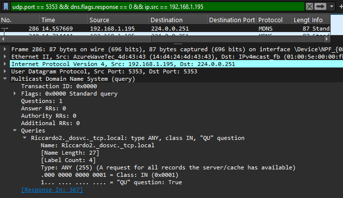
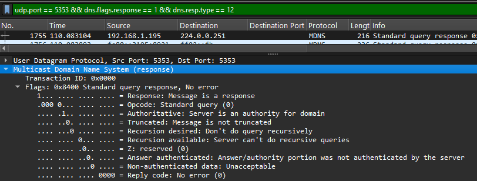
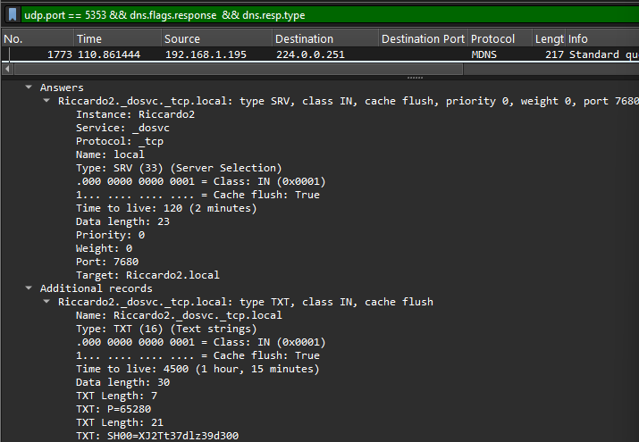
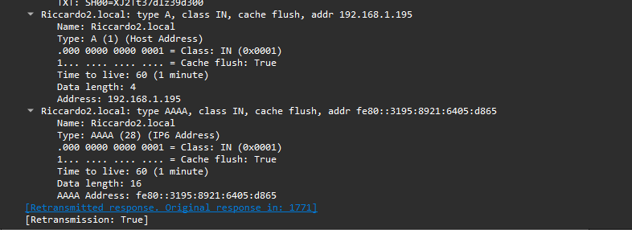

# Progetto di Analisi del Protocollo mDNS

**Domanda guida**: come funziona il processo di discovery mDNS nella mia rete locale e quali pacchetti chiave mostrano il flusso tra query e risposte?

## Inizio della Query mDNS

L’analisi parte dall’identificazione del primo pacchetto inviato dal mio host. Ho applicato il filtro:

`udp.port == 5353 && dns.flags.response == 0 && ip.src == 192.168.1.195`

Con questo filtro vedo soltanto le richieste originate dal mio indirizzo. La prima query appare al frame 286. Anche se esiste un pacchetto precedente al frame 68, quello proveniva da un altro IP (192.168.1.166), quindi non riguarda il mio flusso. 

A livello IPv4, il pacchetto ha come destinazione l’indirizzo 224.0.0.251, tipico del multicast mDNS, utilizzato per comunicare solo all’interno della stessa LAN senza uscire dal router. Guardando il livello Ethernet, il mittente è il mio MAC 14\:d4:24:4d:43:43 (scheda AzureWaveTec) e la destinazione è l’indirizzo multicast 01:00:5e:00:00\:fb, che rappresenta proprio il mapping di 224.0.0.251.

La parte UDP usa la porta 5353 sia come sorgente che come destinazione, valore riservato al protocollo mDNS. Nel contenuto DNS leggo che il Transaction ID è 0x0000 e le Flags sono 0x0000, quindi è una query standard senza campi speciali. L’oggetto della domanda è Riccardo2.\_dosvc.\_tcp.local, cioè un servizio TCP pubblicato in rete. Il frame totale misura 87 byte, somma degli header e della sezione DNS.
 

## Prima Risposta PTR

Per osservare la prima risposta ho applicato il filtro:

`udp.port == 5353 && dns.flags.response == 1 && dns.resp.type == 12`

Con questo filtro trovo il pacchetto al frame 1755, che rappresenta la prima risposta PTR valida. Il payload UDP è di 174 byte. All’interno dei flag DNS leggo 0x8400, che indica due condizioni importanti: QR=1 (quindi è una risposta) e AA=1 (autorevole). Questo significa che la macchina che risponde ha l’autorità sul nome richiesto e può pubblicare direttamente il servizio.
 

Il record PTR collega il servizio \_dosvc.\_tcp.local all’istanza Riccardo2.\_dosvc.\_tcp.local, confermando che il nome richiesto è disponibile in rete. Questa è la base della discovery..capire quali servizi sono presenti e chi li ospita.

## Record SRV e TXT

Dopo il PTR, il passo naturale è trovare i dettagli di connessione. Con l’analisi vedo che al frame 1773 arriva un pacchetto che contiene un record SRV. Questo record è essenziale perché fornisce il nome host e la porta usata. Qui il target è Riccardo2.local e la porta associata è 7680. In questo modo il client non ha solo il nome del servizio, ma anche l’indirizzo reale e il canale per collegarsi.

Nello stesso pacchetto è incluso anche il record TXT, che normalmente può contenere informazioni aggiuntive come il friendly name (“fn=”). Nel mio caso questo campo non è presente, quindi l’host non ha pubblicato descrizioni aggiuntive. Questo non blocca il servizio ma limita le informazioni leggibili da parte dell’utente.
 

Dopo aver ricevuto il record SRV, il client conosce già l’hostname (Riccardo2.local) e la porta (7680) del servizio. Normalmente, il passo successivo sarebbe inviare nuove query mDNS di tipo A (IPv4) e/o AAAA (IPv6) per tradurre l’hostname in un indirizzo IP concreto. Tuttavia, nel nostro caso queste informazioni sono già incluse come record addizionali nella stessa risposta... insieme all’SRV e al TXT, il pacchetto fornisce direttamente l’indirizzo IPv4 (192.168.1.195) e l’indirizzo IPv6 (fe80::3195:8921:6405:d865) associati a Riccardo2.local. In questo modo il client dispone immediatamente di tutti i dati necessari per aprire la connessione, senza dover generare ulteriori query.

 

A questo punto il client ha tutte le informazioni necessarie, cioè...
nome del servizio e istanza (PTR), endpoint (hostname + porta dal record SRV),indirizzo IP (dai record A/AAAA),eventuali parametri aggiuntivi (TXT).

## Fase finale e traffico complessivo
Dopo la discovery iniziale, il protocollo mDNS non termina immediatamente, ma continua con traffico periodico di rinnovo: gli host ripubblicano i propri record a intervalli regolari per restare visibili in rete, mentre i client possono inviare nuove query quando il TTL in cache scade. Questo comportamento spiega perché nella cattura compaiono 360 query e 66 risposte complessive: non tutte le richieste ricevono risposta e molte servono solo come refresh o riguardano servizi non più attivi. I valori di TTL osservati (4500s per PTR/TXT e 120s per SRV) mostrano come alcuni record rimangano validi più a lungo, mentre altri richiedono aggiornamenti frequenti.
Una volta completata la fase di discovery, il client possiede tutte le informazioni necessarie e può quindi aprire una connessione diretta verso l’host indicato. Da quel momento mDNS non interviene più... il traffico passa al protocollo applicativo specifico del servizio (ad esempio TCP/HTTP, RTSP, ecc.), che utilizza la porta annunciata per instaurare la sessione e trasportare i dati reali, come stream audio/video, condivisione dello schermo o, nel caso di _dosvc._tcp.local, il download distribuito degli aggiornamenti di Windows.

